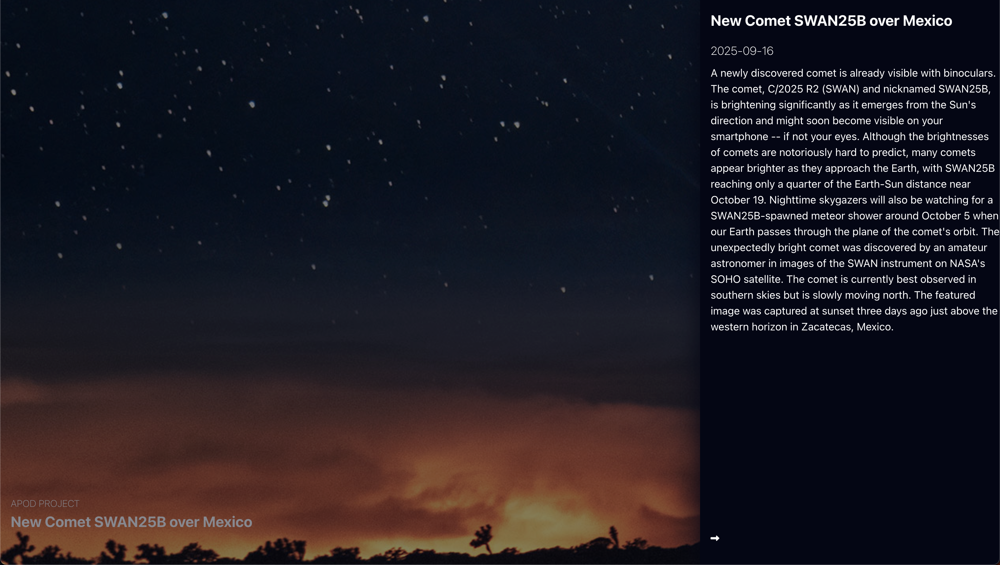

#Astronomy Picture of the Day - NASA 🚀 🌌 🪐

A simple, modern React application that showcases NASA's public API, Astronomy Picture of the Day space imagery and data in an interactive, user-friendly interface. Built as a coding practice in frontend development, API integration, and responsive design.

## Features

- 🌌 Browse NASA's Astronomy Picture of the Day (APOD)
- ⚡ Fast, responsive UI with loading states and error handling
- 🎨 Elegant, accessible design with dark mode support
- 🛠️ Modular, maintainable codebase using React best practices

## Technologies Used

- **React** (with Hooks & functional components)
- **Styled Components**
- **Axios** for API requests
- **React Router** for navigation

## Getting Started

1. **Clone the repository**
   ```bash
   git clone https://github.com/yourusername/nasa-react-app.git
   cd nasa-react-app
   ```

2. **Install dependencies**
   ```bash
   npm install
   # or
   yarn install
   ```

3. **Start the development server**
   ```bash
   npm start
   # or
   yarn start
   ```

4. **Open in browser**
   Visit [http://localhost:3000](http://localhost:3000)

## Usage

- View NASAs Astronomy Picture of the Day
- Unfold Info section to lear details

## Screenshots



## API Reference

- [NASA Open APIs](https://api.nasa.gov/)

## Contributing

Pull requests are welcome!

1. Fork the repo
2. Create your feature branch (`git checkout -b feature/AmazingFeature`)
3. Commit your changes (`git commit -m 'Add some AmazingFeature'`)
4. Push to the branch (`git push origin feature/AmazingFeature`)
5. Open a Pull Request

---
